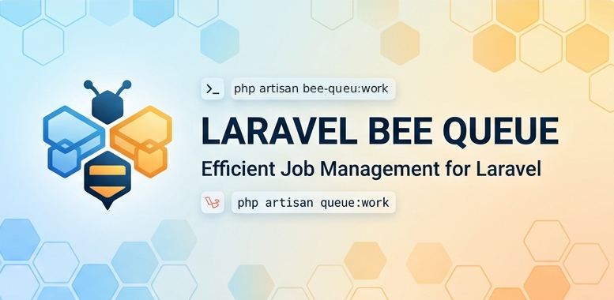

<p align="center">
  
</p>

A simple, fast, Redis-backed job queue for Laravel — a PHP port of [bee-queue](https://github.com/bee-queue/bee-queue) (Node.js).

Jobs pushed from **JS bee-queue** can be consumed by the PHP worker and vice versa — they share the exact same Redis data layout.

---

## Installation

```bash
composer require g4t/laravel-bee-queue
php artisan vendor:publish --tag=bee-queue-config
php artisan vendor:publish --tag=bee-queue-assets
```

> **`bee-queue-assets`** copies the dashboard logo into `public/vendor/bee-queue/`. Run this once after install.

---

## Configuration

Publish the config file and set your `.env` keys:

| Key | Default | Description |
|-----|---------|-------------|
| `BEE_QUEUE_DEFAULT` | `default` | Default queue name |
| `BEE_QUEUE_REDIS_CONNECTION` | `default` | Redis connection from `config/database.php` |
| `BEE_QUEUE_PREFIX` | `bq` | Redis key prefix |
| `BEE_QUEUE_CONCURRENCY` | `1` | Worker concurrency |
| `BEE_QUEUE_TIMEOUT` | `60` | Job timeout in seconds |
| `BEE_QUEUE_STALL_INTERVAL` | `5000` | Stall check interval in ms |
| `BEE_QUEUE_RETRY_ATTEMPTS` | `3` | Max retry attempts |
| `BEE_QUEUE_RETRY_BACKOFF` | `fixed` | `fixed` or `exponential` |
| `BEE_QUEUE_RETRY_DELAY` | `5` | Retry delay in seconds |
| `BEE_QUEUE_REMOVE_ON_SUCCESS` | `false` | Delete job data after success |
| `BEE_QUEUE_REMOVE_ON_FAILURE` | `false` | Delete job data after failure |
| `BEE_QUEUE_DASHBOARD_PATH` | `bee-queue` | URL path for the dashboard |

### Retry backoff strategies

- **`fixed`** — waits the same `BEE_QUEUE_RETRY_DELAY` seconds between every attempt.
- **`exponential`** — doubles the delay on each attempt: `delay × 2^(attempt - 1)`. Useful when downstream services need time to recover.

---

## Basic Usage

### Creating & enqueuing a job

```php
use G4T\BeeQueue\Facades\BeeQueue;

BeeQueue::createJob(['user_id' => 42, 'action' => 'send_welcome_email'])
    ->retries(3)
    ->backoff('exponential') // 'fixed' or 'exponential'
    ->retryDelay(5)
    ->delay(30)              // run 30 seconds from now
    ->timeout(60)
    ->save();

// On a named queue
BeeQueue::queue('emails')
    ->createJob(['to' => 'alice@example.com'])
    ->save();
```

---

## Processing Jobs

### Option 1 — Closure handler (quick/inline)

```php
$worker = BeeQueue::worker();

$worker->process(function ($job) {
    // $job->data contains your payload
    $job->reportProgress(50);
    // do work...
    $job->reportProgress(100);
});
```

### Option 2 — Handler class with `--handler` flag

Create a handler class implementing `JobContract`:

```php
// app/Jobs/ProcessMessage.php
namespace App\Jobs;

use G4T\BeeQueue\Contracts\JobContract;
use G4T\BeeQueue\Job;

class ProcessMessage implements JobContract
{
    public function __construct(private Job $job) {}

    public function handle(): void
    {
        $data = $this->job->data;
        // process $data...
    }
}
```

Run the worker with it:

```bash
php artisan bee-queue:work --handler=App\\Jobs\\ProcessMessage
php artisan bee-queue:work emails --handler=App\\Jobs\\ProcessMessage
```

This handler receives **every** job on that queue regardless of data content — ideal for jobs pushed from JS bee-queue.

### Option 3 — Auto-resolve handler from job data

Include a `class` key when pushing from PHP:

```php
BeeQueue::createJob([
    'class' => App\Jobs\ProcessMessage::class,
    'text'  => 'hello',
])->save();
```

Run the worker without `--handler` — it will auto-resolve the class:

```bash
php artisan bee-queue:work
```

### Routing multiple job types in one handler

```php
public function handle(): void
{
    match ($this->job->data['action'] ?? null) {
        'send_email'    => $this->sendEmail(),
        'resize_image'  => $this->resizeImage(),
        default         => \Log::warning('Unknown action', $this->job->data),
    };
}
```

---

## Artisan Commands

```bash
# Start a worker (runs forever)
php artisan bee-queue:work

# Start on a named queue
php artisan bee-queue:work emails

# With a specific handler class
php artisan bee-queue:work --handler=App\\Jobs\\ProcessMessage

# Process one job and exit
php artisan bee-queue:work --once

# Show queue health stats
php artisan bee-queue:stats
php artisan bee-queue:stats emails
```

---

## Dashboard

The package ships with a built-in web dashboard for monitoring and managing your queues.

### Setup

```bash
# Publish the dashboard logo asset (required once)
php artisan vendor:publish --tag=bee-queue-assets
```

### Accessing the dashboard

Visit `/bee-queue` in your browser (or whatever path you set via `BEE_QUEUE_DASHBOARD_PATH`).

### Features

- **Stats cards** — live counts for waiting, active, succeeded, failed, and delayed jobs. Click any card to filter the job list.
- **Job table** — shows job ID, status badge, payload data, timestamp, and progress bar.
- **Retry** — re-queues a failed job back to the waiting list with a fresh timestamp.
- **Delete** — removes a job from all Redis keys permanently.
- **Auto-refresh** — page reloads every 5 seconds with a countdown timer.
- **Queue switcher** — switch between named queues from the header input.

### Middleware & path

Configure the dashboard in `config/bee-queue.php`:

```php
'dashboard' => [
    'path'       => env('BEE_QUEUE_DASHBOARD_PATH', 'bee-queue'),
    'middleware' => ['web'],  // add 'auth' or your own middleware here
],
```

To protect the dashboard behind authentication:

```php
'middleware' => ['web', 'auth'],
```

---

## Events

Listen to these events in your `EventServiceProvider`:

| Event | Properties | Description |
|-------|-----------|-------------|
| `G4T\BeeQueue\Events\JobSucceeded` | `$job` | Job completed successfully |
| `G4T\BeeQueue\Events\JobFailed` | `$job`, `$exception` | Job exhausted all retries |
| `G4T\BeeQueue\Events\JobRetrying` | `$job`, `$exception`, `$nextAttempt` | Job is being retried |
| `G4T\BeeQueue\Events\JobProgress` | `$job`, `$progress` | Job reported progress |

```php
use G4T\BeeQueue\Events\JobFailed;
use G4T\BeeQueue\Events\JobSucceeded;

Event::listen(JobSucceeded::class, function ($event) {
    \Log::info('Job done', ['id' => $event->job->id]);
});

Event::listen(JobFailed::class, function ($event) {
    \Log::error('Job failed', [
        'id'    => $event->job->id,
        'error' => $event->exception->getMessage(),
    ]);
});
```

---

## Cross-compatibility with JS bee-queue

This package uses the **exact same Redis data layout** as the Node.js bee-queue library, so you can mix producers and consumers across languages:

```js
// Node.js — push a job
const Queue = require('bee-queue');
const queue = new Queue('default');
queue.createJob({ text: 'Hello from Node' }).save();
```

```bash
# PHP — consume it
php artisan bee-queue:work --handler=App\\Jobs\\ProcessMessage
```

---

## Redis Data Layout

```
bq:{queue}:id          — STRING  — auto-increment job ID counter
bq:{queue}:jobs        — HASH    — field=id, value=JSON job payload
bq:{queue}:waiting     — LIST    — IDs of jobs waiting to be processed
bq:{queue}:active      — LIST    — IDs of jobs currently being processed
bq:{queue}:succeeded   — SET     — IDs of successfully completed jobs
bq:{queue}:failed      — SET     — IDs of failed jobs
bq:{queue}:delayed     — ZSET    — IDs of delayed jobs (scored by run-at timestamp)
bq:{queue}:stallBlock  — STRING  — TTL-based lock for stall detection
```

Each job is stored as a JSON string in the `jobs` hash:

```json
{
  "data": { "your": "payload" },
  "options": {
    "timestamp": 1779186989503,
    "stacktraces": [],
    "retries": 3,
    "backoff": "exponential",
    "retryDelay": 5,
    "timeout": 60,
    "delay": null
  },
  "status": "succeeded",
  "progress": 0
}
```

---

## License

MIT

<p align="center">
  
</p>
